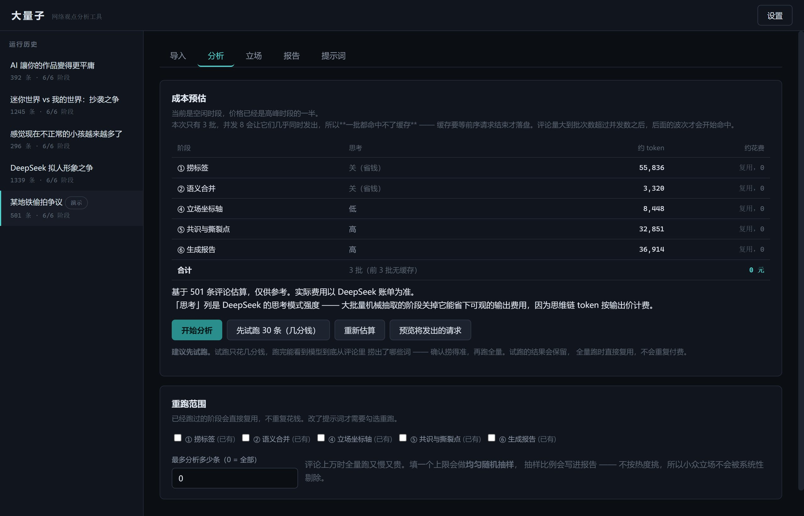
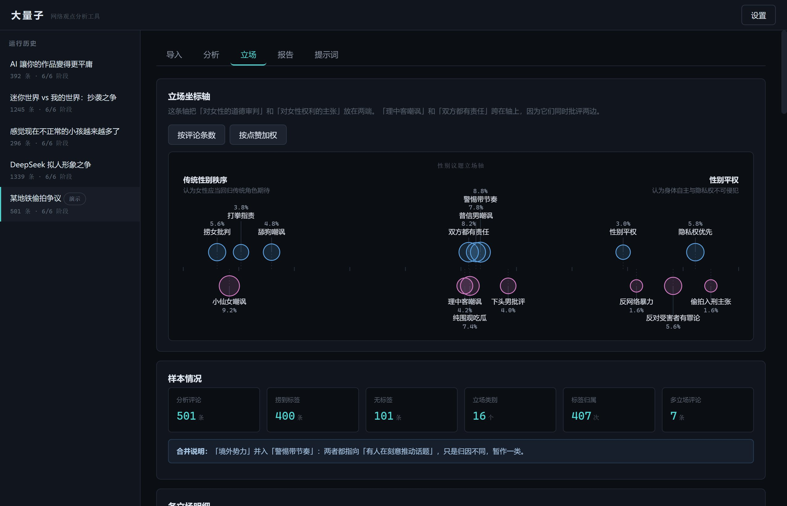

# 大量子 · 网络观点分析工具

> 名字取自《超新星纪元》里那台为孩子们做信息筛选的超级计算机。
> 它的核心能力不是「统计」，是**从噪音中提炼 + 分类呈报**。

把一个网络事件下的成千上万条评论，自动归纳成几个**带条数占比的立场类别**，
再用一条**立场坐标轴**把各方排开，最后生成一份「立场一览」式分析报告。

参考对象是 B 站 UP 主「混乱粉笔」的选题结构和呈现方式：
从评论原文里提炼出**网民真正在主张什么**，
并把「小仙女」「下头男」「赛博藤壶」这类**社群自造的词**作为质感保留下来。

---

## 长什么样

**分析页** —— 花钱之前先把账算清楚。分阶段预估、哪些阶段会直接复用、每个阶段思考模式
开不开、抽样上限，都在一屏里：



**立场页** —— 核心产出。一条坐标轴把所有立场摊开：**横坐标是模型给的两极贴合度算出来的**
（不是模型随口给的，见下面「轴位是推导出来的，不是模型随口给的」），
**圆的面积正比于条数**，上下分道只是为了让标签不叠在一起、没有含义：



> 截图是 `python tests/make_demo_run.py` 生成的**演示数据**，不含真实网友发言。

---

## 快速开始

### 一键启动（Windows）

**双击项目根目录的 `启动.bat`。** 它会自己切到 UTF-8 控制台、找到 Python、自检、
起服务，并**等端口真的能连上之后再打开浏览器** —— 不用手动去点那个地址。

再双击一次不会起第二个服务：它检测到已经在跑，就只把浏览器递过去。
**关掉那个窗口（或按 `Ctrl+C`）就是停止。**

### 命令行启动

```bash
cd 大量子
python run.py              # 默认 http://127.0.0.1:8770
python run.py --open       # 起服务 + 自动开浏览器（macOS / Linux 用这个）
python run.py --port 8765  # 换端口
python run.py --check      # 只自检，不起服务
```

**这里只有一个进程，没有前后端之分，也没有「先起后端再起前端」这回事。**
后端是 Flask，前端是原生 JS，两者由后端在**同一个端口**上一起发出去
（`/` 发 `index.html`，`/static/*` 发 `app.js` / `axis.js` / `style.css`）。
所以不需要 npm、不需要构建步骤、不需要开第二个终端 ——
在 `daliangzi/web/` 里找不到 `package.json` 是正常的，不是缺文件。

浏览器打开 **http://127.0.0.1:8770**，点右上角「设置」填入 DeepSeek API Key，然后：

1. **导入** —— 粘贴评论或上传文件，点「解析预览」确认字段识别正确，再点「导入」
2. **分析** —— 先点「**先试跑 30 条**」（几分钱）看模型捞出来的标签准不准，
   确认没问题再点「开始分析」跑全量
3. **立场** —— 立场坐标轴 + 各类别明细
4. **报告** —— 共识/撕裂点 + 完整文章，可导出 Markdown

### 为什么建议先试跑

这个工具的质量上限取决于第一步「从评论里捞标签」准不准。而这一步好不好，
只有拿你自己的数据看了才知道 —— 不同事件、不同平台的用语差别很大。

试跑抽 30 条只跑第一步，花几分钱，跑完会列出**每条评论 → 捞出了哪些词**，
你可以直接核对两件事：

- 标签词是不是**评论里真实出现的词**，而不是模型发明的学术分类
- 该有立场的地方是不是空着（空太多说明提示词太严，去「提示词」页调 stage1）

试跑的结果会保留，跑全量时**直接复用，不会重复付费**。

花钱之前还可以点「预览将发出的请求」，看到第一个批次的真实请求体（Key 只露首尾）。

没有分析数据时想先看看界面长什么样：

```bash
python tests/make_demo_run.py    # 生成一份 mock 演示数据，不花一分钱
```

自检（起服务前排查环境问题）：

```bash
python run.py --check
```

---

## 设计原则

### 1. LLM 只做归纳，绝不做计数

这是整个架构最重要的一条。大模型数数不准 —— 让它「统计每个类别多少条」，它会给你一个
看起来合理但是编的数字。所以：

```
❌ 把 500 条评论扔给 LLM，让它输出「类别A：137条，27%」
✅ LLM 只负责给每条评论打上标签，计数用 Python 对标签做 Counter
```

LLM 的输出里**永远不出现条数和百分比**。占比全部由代码算出来，所以一定自洽、一定能回溯。

### 2. 标签必须从原文捞，而且必须留证

每个标签都记下来源评论 ID 和原文片段。任何一类占比都能下钻到具体评论。
这是这个工具和「AI 瞎编一份报告」的根本区别。

### 3. 两段式归约压成本

```
第一级（贵，可并发）  10,000 条评论  →  每条评论的标签词
第二级（便宜，一次）   ~800 个不同标签 →  ~15 个立场类别
第三级（免费，确定性） 别名映射表把评论归到大类
```

评论可能几万条，但不同的标签词只有几百到几千个。第二级只喂去重后的标签词清单，
输入量小一个数量级。

### 4. 提示词按「稳定前缀 + 变化后缀」组织

DeepSeek 的缓存命中输入价是 **0.02 元/M**，未命中是 **1 元/M** —— 差 50 倍。
所以所有批次共用的那一大段指令放在提示词最前面且逐字不变，
变化的评论数据放最后。第一次调用之后的每一次都命中缓存。

空闲时段（工作日 9-12、14-18 之外，以及周末和法定节假日全天）价格再减半。
工具会在预估里提示这一点。

### 5. 每阶段产物落盘，可断点续跑

```
data/runs/<run_id>/
├── 00_input.json       清洗去重后的评论
├── 01_labels.json      逐条捞取的标签（最贵的一步）
├── 02_canonical.json   合并后的立场类别 + 别名映射表
├── 03_stats.json       确定性统计出的条数与占比
├── 04_axis.json        坐标轴排布
├── 05_jury.json        陪审团打分
└── 06_report.json      最终报告
```

改了提示词想重跑第二步？只重跑第二步，第一步的结果直接复用，不重复花钱。

### 6. 轴位是推导出来的，不是模型随口给的

坐标轴这一步，模型**只判断每个立场与两极的贴合度**（0~100 两个分数），
位置由代码算：`x = right_affinity / (left_affinity + right_affinity)`。

早先的版本让模型直接输出 `x ∈ [0,1]`，那有两个毛病：数值不可复现，
而且「让模型把立场摊开一点」等于逼它**凭空制造对立**。
现在模型给的两个分数会一并存下来，轴位随时可追溯、可复算。

---

## 五阶段流水线

```
粘贴/上传
   ↓
[清洗去重]  去广告、去灌水、去重复、保留点赞数（如实汇报丢掉了什么）
   ↓
① 捞标签        逐条提取 {term, claim, stance, evidence}；JSON Output + 并集校验防偷懒
   ↓
② 语义合并      去重标签词 + 代表原文 → 立场类别 + 别名映射表（防止同词反用被错误合并）
   ↓
③ 统计占比      **纯 Python**，两个口径：按条数 / 按点赞加权
   ↓
④ 坐标轴        模型定两极 + 给贴合度 → 代码算位置
   ↓
⑤ 共识与撕裂点   模拟陪审团打分 → 代码算均值和方差 → 共识 / 撕裂点
   ↓
⑥ 报告          「立场一览」式 Markdown，可导出
```

### 评论太多怎么办：抽样

评论上万时全量跑又慢又贵。在「分析」页填一个「最多分析多少条」上限，
工具会做**均匀随机抽样**（固定随机种子，重跑抽到同一批），并且：

- 抽样比例和抽样说明会写进统计和报告，**不隐瞒**
- 抽的是**随机样本，不是按热度挑的** —— 所以小众立场不会被系统性地剔除
- 占比的分母是抽样后的条数，报告里会写明

不填（0）就是全部分析。

---

## 支持的输入格式

| 格式 | 说明 |
|---|---|
| `.txt` | 一行一条评论 |
| `.csv` / `.tsv` | 自动识别正文字段与点赞字段，识别错了可在界面上手动改 |
| `.json` | 自动摊平嵌套结构（含二级评论 `sub_comments`） |
| `.jsonl` | MediaCrawler 的默认落盘格式 |
| `.xlsx` | 需要 pandas（本机通常已有） |

字段名自动识别，覆盖常见中英文命名：正文 `content/评论/内容/正文/comment/text`，
点赞 `like_count/点赞数/digg_count`，作者 `nickname/昵称/author`，等等。

### 关于评论采集

**采集与分析是完全解耦的。** 采集层是最脆弱、最容易失效、法律风险最高的一环，
所以这里不做爬虫 —— 只做导入适配。

评论从哪来，取决于你要哪个平台。调研结论（详见 `docs/调研/`）：

| 平台 | 推荐方案 | 备注 |
|---|---|---|
| 百度贴吧 | **aiotieba** | pip 库，匿名即可取楼中楼，最省事 |
| 抖音 | **Douyin_TikTok_Download_API** | Apache-2.0，许可证最干净 |
| 小红书 | **Spider_XHS** | 签名本地纯算，不需浏览器；风控最严 |
| 微博 | **weibo-crawler** | 评论只在一级，且仅 sqlite 模式有效 |
| 知乎 | **ZhihuApis** | x-zse-96 动态签名，需 Cookie |
| B站 | MediaCrawler 模块 | ⚠️ `bilibili-api` 已关停，`bilibili-API-collect` 已 archived，法律风险 > 技术风险 |
| 全平台 | **MediaCrawler** | 七平台通吃，但许可是**非商用**、无库 API、评论默认关闭 |

用这些工具爬到数据后，存成 CSV/JSON 导进「大量子」即可。
自定义列名也能导入 —— 界面上点选哪列是评论、哪列是点赞。

---

## 目录结构

```
大量子/
├── 启动.bat                    Windows 一键启动（双击 = python run.py --open）
├── run.py                      启动入口（--open 自动开浏览器，--check 只自检）
├── daliangzi/
│   ├── config.py               配置 + 密钥 + DeepSeek 定价表
│   ├── llm.py                  DeepSeek 客户端：JSON 输出、并发、重试、用量统计
│   ├── prompts_loader.py       提示词加载（带 mtime 缓存，改了即时生效）
│   ├── store.py                运行产物持久化 / 断点续跑
│   ├── ingest/
│   │   ├── model.py            Comment / Label / Stance / Axis 数据模型
│   │   └── parse.py            多格式解析 + 清洗去重
│   ├── pipeline/
│   │   ├── __init__.py         编排五个阶段，管理断点续跑
│   │   ├── stage1_labels.py    逐条捞标签（含防偷懒的并集校验）
│   │   ├── stage2_canon.py     语义合并
│   │   ├── stage3_count.py     确定性统计
│   │   ├── stage4_axis.py      坐标轴
│   │   └── stage5_report.py    陪审团 + 报告
│   ├── prompts/                五个提示词（可以直接改）
│   └── web/
│       ├── server.py           Flask API + SSE 进度推送
│       └── static/             前端（原生 JS，零构建、零 CDN）
├── tests/
│   ├── test_pipeline.py        管道测试（mock LLM，不花钱）
│   └── make_demo_run.py        生成演示数据
├── docs/
│   ├── 架构设计.md
│   ├── images/                  README 里的界面截图
│   └── 调研/                    开源生态调研报告
└── data/runs/                  运行数据
```

**没有新增依赖。** 只用本机已有的 Flask / httpx / pydantic / pandas。
不需要 npm、不需要构建步骤、前端不引 CDN，断网也能用。

---

## 提示词

整个工具的灵魂，全部在 `daliangzi/prompts/`，可以直接在网页「提示词」页里改：

| 文件 | 作用 |
|---|---|
| `stage1_标签.md` | 逐条捞取标签。核心约束：只许用原文里的词，不许发明分类 |
| `stage2_合并.md` | 合并成立场类别。核心约束：同词反用（女权/女拳）不能合并 |
| `stage4_坐标轴.md` | 定两极 + 给贴合度 |
| `stage5_陪审团.md` | 提命题 + 扮演各立场打分 |
| `stage5_报告.md` | 生成最终文章 |

改完保存即生效（带 mtime 缓存）。改过之后要在「分析」页勾选对应阶段重跑。

---

## 成本

以 5000 条评论为例，`deepseek-flash` 空闲时段大约 **3~6 元**。
运行前会显示分阶段预估（含思考模式和缓存情况），运行后显示实际花费。

**两个真正影响花费的设置：**

**思考模式按阶段关。** DeepSeek **默认打开思考模式且 effort=high**。
阶段一要处理几千条评论，是最机械的批量抽取 —— 开着它模型会先吐一大段思维链，
而这些 token **按输出价计费**（flash 空闲时段 4 元/M，而输入未命中才 1 元/M）。
所以机械阶段显式关掉，只在陪审团、报告这些真正需要判断的阶段保留。
附带好处：思考模式下 `temperature` 会静默失效，关掉之后它才真正生效。

**缓存没想象中好拿。** 缓存命中输入价 0.02 元/M，未命中 1 元/M，差 50 倍。
但官方规则要求**完整匹配缓存前缀单元**，而公共前缀要等系统检测后才落盘 ——
前两次请求都不命中。推论是：**并发数 ≥ 批次数时，一批都命中不了缓存**，
因为它们几乎同时发出。只有批次数超过并发数，后面的波次才开始命中。
预估面板会如实告诉你本次是哪种情况。

空闲时段（工作日 9-12、14-18 之外，以及周末和法定节假日全天）价格再减半。

### 花钱之前可以先看

点「预览将发出的请求」，会把第一个批次的**真实请求体**原样展示出来
（Key 只露首尾）。这是第一次配置好 Key、准备跑之前值得看一眼的东西。

---

## 测试

```bash
python tests/test_pipeline.py    # 95 项：解析清洗、确定性统计、端到端管道、断点续跑、抽样、失败快速上报
python tests/test_web_api.py     # 58 项：HTTP 接口、错误处理、路径穿越、只读查询不产生副作用
python tests/test_live_api.py    # 23 项：请求体构造 + 真实网络往返（用无效 Key，不产生费用）
```

`test_live_api.py` 是唯一会真的联网的一套。它用一个故意无效的 Key 打
`api.deepseek.com`，验证 URL 拼装、请求头、请求体形状、401 错误映射都正确 ——
拿得到 401 而不是连接错误，说明请求确实到达了服务端；
不是 400 说明请求体的参数形状是合法的。不花钱。

### 辅助脚本

| 脚本 | 用途 |
|---|---|
| `tests/check_secrets.py` | **提交前必跑**。扫全树找密钥、令牌、cookie，并确认 `.env` / `data/` 被忽略 |
| `tests/verify_remote_clean.py` | 推到远端之后，**从 GitHub 上**再验一遍没有密钥泄露 |
| `tests/make_demo_run.py` | 生成一份 mock 演示数据，零成本看界面长什么样 |
| `tests/dump_result.py` | 把某次 run 的完整结果导成 Markdown |
| `tests/label_report.py` | 把观点提炼质量导成可读报告，用于人工核对 |
| `tests/check_github_auth.py` | 验证本机保存的 GitHub 凭据是否可用 |
| `tests/push_to_github.py` | 建仓库并推送（令牌用一次性 URL，不落盘） |

> 国内网络下 `github.com:443` 常被墙（但 `api.github.com` 和 `ssh.github.com` 通），
> 且 Git for Windows 默认的 schannel 后端在受限环境里会报 `SEC_E_NO_CREDENTIALS`。
> `push_to_github.py` 里已经处理了这两点：走本机代理 + 换 OpenSSL 后端。

---

## 已知的坑与对策

| 坑 | 对策 |
|---|---|
| **DeepSeek 默认开着思考模式且 effort=high**，机械抽取阶段会白烧几倍的输出 token；且思考模式下 `temperature` 静默失效 | 按阶段显式传 `thinking`，机械阶段关掉（`THINKING_BY_STAGE`） |
| **并发 ≥ 批次数时缓存一批都命中不了**（缓存要等前序请求落盘） | 成本预估按真实缓存模型算，不做乐观假设 |
| JSON Output 要求提示词含 `json` 字样 | 加了测试逐个校验四个 JSON 阶段的提示词 |
| 思考模式下 `max_tokens` 会被思维链吃掉 | 开思考的两步给足余量（24576 / 32768） |
| DeepSeek JSON Output 有概率返回空 content（官方承认） | 空响应重试；整批失败降级为拆半重试 |
| 模型会「偷懒合并」，200 条只输出 30 条标签 | 提示词强制逐条 + 代码校验**输出 ID 集合 == 输入 ID 集合**，缺了单独补跑 |
| 模型会「发明」学术分类 | 提示词写死「只允许使用评论原文中的词」，并给正反例 |
| 中文「同词反用」（女权/女拳）被错误合并 | 阶段二提示词点名这条铁律，争议合并写进 `merge_notes` |
| 阶段一整体失败后会静默穿过空阶段，直到生成报告才炸 | 失败快速上报：捞不到标签立刻停下并说清排查方向 |
| 失败的运行也已经花了钱 | 错误信息带上已消耗金额，并说明产物已保留、重跑会复用 |
| `stats` 落盘早于坐标轴，读回来 `x` 丢了 | 坐标轴跑完补存一次，API 读旧数据时再合并回去 |
| 占比口径歧义（一条 10 万赞 vs 一条 0 赞） | 两个口径都算、并排显示，不替用户选 |
| 一条评论多个立场导致占比之和 > 100% | 同时提供「构成占比」（加起来正好 100%），报告强制声明 |
| 未归类评论被默默排除 | 报告必须声明分母：「基于 N 条，其中 X 条没有归入任何立场」 |
| 同一条评论重复同一个词刷权重 | 一条评论对同一类别只计一次 |
| 坐标轴在窄屏下被等比缩到不可读 | 按容器实际宽度 1:1 像素渲染 + `ResizeObserver` 重画 |
| **双击 `.bat` 时中文糊成乱码** | `run.py` 把 stdout 强制成 UTF-8，而双击启动的 cmd 默认是 cp936；所以 `启动.bat` 先 `chcp 65001` 且正文只写 ASCII，中文全部交给 run.py 输出 |
| **查询一个不存在的 run 会凭空创建空目录** | `Run.__init__` 不 `mkdir`，改为写入时才创建 |
| 父评论记录带着整个 `sub_comments` 数组，落盘翻倍 | 摊平时剥掉嵌套字段 |

---

## 免责

评论采集涉及平台条款与法律风险，工具本身不做采集，也不对采集行为负责。
分析结果基于样本，不代表全量民意 —— 报告里会明确标注样本量。
